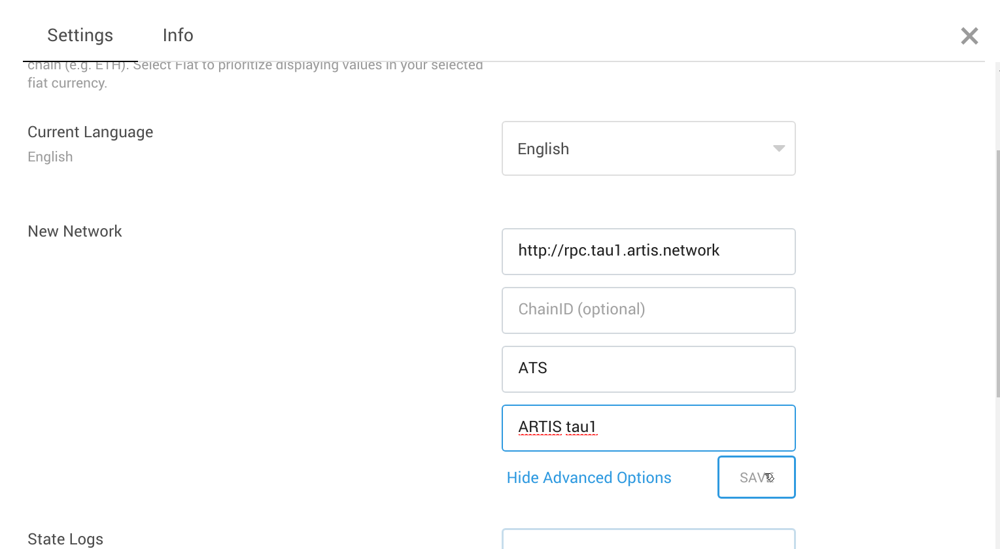

# How to ...

## run a node

* `git clone https://github.com/lab10-coop/tau1`
* `cd tau1`
* Create a symlink of the binary suited for your operating system, e.g. `ln -s parity-linux parity` for Linux.
* Run: `./parity -c node.toml`

## run a trustnode
  
**Prepare**
* `git clone https://github.com/lab10-coop/tau1`
* `cd tau1`
* Create a symlink of the binary suited for your operating system, e.g. `ln -s parity-linux parity` for Linux.

**Add your _mining key_**
* Copy the keyfile (json) of your mining key into `data/keys/tau1.artis` (create directory if it doesn't exist yet). The filename doesn't matter.
* Create a file `password.txt` containing the password to unlock the keyfile.

**Adapt the config**  
* Copy `trustnode.toml.example` to `trustnode.toml`.
* Open `trustnode.toml` with your favourite editor and replace every `<PLACEHOLDER>` entry.

**Run**
`./parity -c trustnode.toml`

**Keep running**  
A trustnode is supposed to be always on, thus running it in an interactive shell isn't the best option.  
This repository includes a systemd template config you can use to make parity a system service.  
The following steps require root privileges (sudo).  
* Copy `artis-tau1-parity.service.example` to `/etc/systemd/system/artis-tau1-parity.service` (if that directory doesn't exist, you're likely not using systemd and can't use this method).
* Start the service: `systemctl start artis-tau1-parity`
* Flag service to be started on boot: `systemctl enable artis-tau1-parity`

You can check the status of the service with `systemctl status artis-tau1-parity`.

## use with Metamask

[Metamask](https://metamask.io/) is a browser extension which implements an Ethereum wallet. It can be used with any Ethereum compatible network.  
Once you have Metamask installed:
* Open and unlock Metamask
* Click the _Networks_ dropdown and choose _Custom RPC_
* For _RPC URL_, enter "http://rpc.tau1.artis.network"
* (optional, but convenient) Click _show advanced options_, then enter "ATS" for _Symbol_ and "ARTIS tau1" for _Nickame_
* Click _SAVE_

## get ATS

In order to transact with the network, you need ATS for tx fees.  
There's a faucet for that: call
http://faucet.tau1.artis.network/addr/<ADDRESS_TO_BE_FUNDED>  
(replace <ADDRESS_TO_BE_FUNDED> with the address of the account you want to get ATS for).  Every call triggers a transfer of 1 ATS.  

# About

τ1 is an ARTIS testnet.  
It makes use of several open source contributions of the fantastic Ethereum community, most importantly those of [poa.network](https://github.com/poanetwork/) and [Paritytech](https://github.com/paritytech/).

This directory includes a binary build of the parity-ethereum client ([version 2.0.8](https://github.com/paritytech/parity-ethereum/releases/tag/v2.0.8)) for convenience. Instructions for building from source can be found [here](https://github.com/paritytech/parity-ethereum).  
Newer versions of Parity are expected to be compatible (able to sync with this chain), older ones are not!
