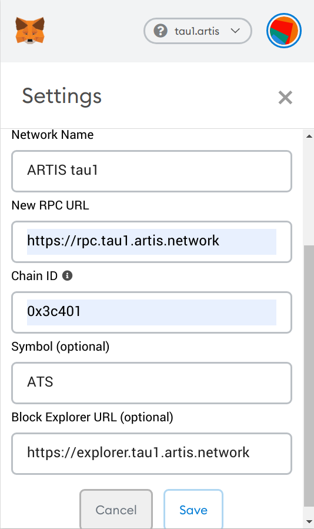

# How to ...

## Run a node

**Prepare**  
```
git clone https://github.com/lab10-coop/tau1
cd tau1
./download-parity.sh
```

**Run**    
`./parity -c node.toml`

## Run a trustnode

**Create a user**  
This step is optional.  
For the smoothest setup journey (least changes necessary), create a user named "artis".  
Execute as root:
```
adduser --disabled-password artis
su artis
cd
```
Now you are in directory `/home/artis` as user `artis`.  
In case you prefer to have an account which allows login with password, omit `--disabled-password` and make sure you're using a strong password!
  
**Prepare**
```
git clone https://github.com/lab10-coop/tau1`
cd tau1
./download-parity.sh
```

**Create an account**  
```
./parity -c node.toml account new
```
This will ask you for a password. Hint: use [pwgen](https://linux.die.net/man/1/pwgen)  
After entering the password twice, there will be a new file (a JSON formatted _keystore_ file) in `data/keys/tau1.artis/`.

Now, create a file `password.txt` and paste the password into it.

(If you prefer another method for creating the mining key, feel free to do so.)

**Adapt the config**  
* Copy `trustnode.toml.example` to `trustnode.toml`.
* Open `trustnode.toml` with your favourite editor and set the missing values for _identity_, _unlock_ and _engine_signer_ (see inline comments and examples)

**Initial run**  
`./parity -c trustnode.toml`  
On first run, Parity creates a _node key_ which is stored in `data/network/key`. This key, the IP address and P2P port are combined to an _enode_ (more details [here](https://github.com/ethereum/wiki/wiki/enode-url-format)) which uniquely identifies your node. Your node's enode is printed to the console after a few seconds.  
Example: `enode://65ef6f4a59fcbbd0567de0671588ab03e6d0628005f5b514af3295736a76f3ea30b5ecde8e64a5cc0aa20bfa8c5b7bb425470b8e9c9e6b05b34892f2a7f7ec15@94.130.160.202:30303`
Make sure the contained IP address is Internet routable (if your host system has multiple network interfaces / IPs, Parity may not choose the correct one) and that the selected port (default: 30303) is accessible from the outside (not blocked by a firewall).   

If Parity started syncing the chain, you can stop it with Ctrl-C and proceed with the next step.

Warning: When starting a trustnode which isn't yet allowed to create blocks, you may see entries like this in the parity log:
```
Dec 11 12:32:05 your.hostname parity[7400]: 2018-12-11 12:32:05 UTC Closing the block failed with error Error(Engine(FailedSystemCall("Cannot decode address[]")), State { next_error: None, backtrace: InternalBacktrace { backtrace: None } }). This is likely an error in chain specificiations or on-chain consensus smart contracts.
```
Don't worry, this is without consequences and usually goes away once your trustnode starts producing blocks (which is the case once your _mining key_ was added to the [validator set](https://wiki.parity.io/Validator-Set.html)).

**Keep running**  
A trustnode is supposed to be always on, thus running it in an interactive shell isn't the best option.  
This repository includes a systemd template config you can use to make parity a system service.  
The following steps require root privileges (sudo).  
* Copy `artis-tau1-parity.service.example` to `/etc/systemd/system/artis-tau1-parity.service` (if that directory doesn't exist, you're likely not using systemd and can't use this method).
* Open the copied file and set _User_, _Group_, _WorkingDirectory_ and _ExecStart_ to values matching your setup
* Start the service: `systemctl start artis-tau1-parity`
* Enable start-on-boot: `systemctl enable artis-tau1-parity`

Finally, make sure the service is running: `systemctl status artis-tau1-parity`.  
In order to see a live log, do `journalctl -f -u artis-tau1-parity` (Ctrl-C will get you back).

## get listed in status dashboard

There's a nice network status dashboard at http://status.tau1.artis.network/  
It only lists nodes which want to be listed.  
In order to be on the list, a dedicated status reporting application needs to run alongside parity.  

If you run a trustnode, please get it listed.  

**Prepare**  
Check which version of nodejs you have installed (if any):
`node --version`  
Anything newer than v6 should do.

If you don't have it installed, your options depend on the operating system.

_Ubuntu 18.04_:  
```
apt install nodejs npm
```

_Ubuntu 16.04_:  
```
curl -sL https://deb.nodesource.com/setup_10.x -o nodesource_setup.sh
bash nodesource_setup.sh
apt install nodejs
```
(Of course you can take a look into `nodesource_setup.sh` before executing it with root permissions.)

**Install**  
Next, get the application:
```
cd
git clone https://github.com/lab10-coop/node-status-reporter
cd node-status-reporter
npm install
```

**Test run**  
Now you _could_ run it with  
`NODE_ENV=production INSTANCE_NAME=<your instance name here> WS_SERVER=http://status.tau1.artis.network WS_SECRET=ahZahhoth3engaem npm start`

**Keep running**

If you installed a service for parity, you should do the same for this application. With root privileges, do:
* Copy `artis-tau1-statusreporter.service.example` to `/etc/systemd/system/artis-tau1-statusreporter.service`.
* Open the copied file and adapt it to your needs. Important: set values for _INSTANCE_NAME_ and _CONTACT_DETAILS_ and then uncomment both. Please use `<nick>.tau1.artis.network` as value for _INSTANCE_NAME_ - replace `<nick>` with a nickname of your choice (using ASCII characters and digits only). Example: randomguy.tau1.artis.network
* Start the service: `systemctl start artis-tau1-statusreporter`
* Flag service to be started on boot: `systemctl enable artis-tau1-statusreporter`

You can check the status of the service with `systemctl status artis-tau1-statusreporter`.

## use with Metamask

[Metamask](https://metamask.io/) is a browser extension which implements an Ethereum wallet. It can be used with any Ethereum compatible network.  
Once you have Metamask installed:
* Open and unlock Metamask
* Click the _Networks_ dropdown and choose _Custom RPC_
* For _RPC URL_, enter "http://rpc.tau1.artis.network"
* (optional, but convenient) Click _show advanced options_, then enter "ATS" for _Symbol_ and "ARTIS tau1" for _Nickame_
* Click _SAVE_



## get ATS

In order to transact with the network, you need ATS for tx fees.  
There's a faucet for that: call
http://faucet.tau1.artis.network/ats/<ADDRESS_TO_BE_FUNDED>  
(replace <ADDRESS_TO_BE_FUNDED> with the address of the account you want to get ATS for).  Every call triggers a transfer of 1 ATS.  

# About

τ1 is an ARTIS testnet.  
It makes use of several open source contributions of the fantastic Ethereum community, most importantly those of [poa.network](https://github.com/poanetwork/) and [Paritytech](https://github.com/paritytech/).

For convenience, this directory contains a script downloading a binary provided by Paritytech. Instructions for building from source can be found [here](https://github.com/paritytech/parity-ethereum).  
Newer versions of Parity are expected to be compatible (able to sync with this chain). Versions older than 2.0.8 are known to be incompatible with this chain.

# Updates

## HF1

This is the first hardfork.  

### Why

It disables [EIP-1283](https://eips.ethereum.org/EIPS/eip-1283).  
EIP-1283 was enabled from the start on tau1, because it was expected to also be enabled on Ethereum with the Constantinople HF. However, briefly before that scheduled HF, it was discovered that EIP-1283 [enables a new reentrancy attack](https://medium.com/chainsecurity/constantinople-enables-new-reentrancy-attack-ace4088297d9). As explained in that article, this attack is possible only in the context of a smart contract with very specific properties (basically, if the recommended [Checks-Effects-Interactions-Pattern](https://solidity.readthedocs.io/en/v0.5.2/security-considerations.html#use-the-checks-effects-interactions-pattern) is not applied).  
No such vulnerable smart contract exists on tau1. Nevertheless we apply the change in order to keep the EVM configuration as similar as possible to that of Ethereum. In this case, it's about keeping the amount of gas consumed by transactions the same across networks - with EIP-1283 enabled, many transactions consume less gas.

### How

1.  Update your local copy of this repository with `git pull`
2.  Execute `./donwload-parity.sh --force`. This updates your parity binary to a new version which understands the change in the chain specification file
3.  Restart the Parity service with `systemctl restart artis-tau1-parity`
4.  Make sure the service is running: `systemctl status artis-tau1-parity`
5.  Report the executed update to the tau1 trustnode chat channel
